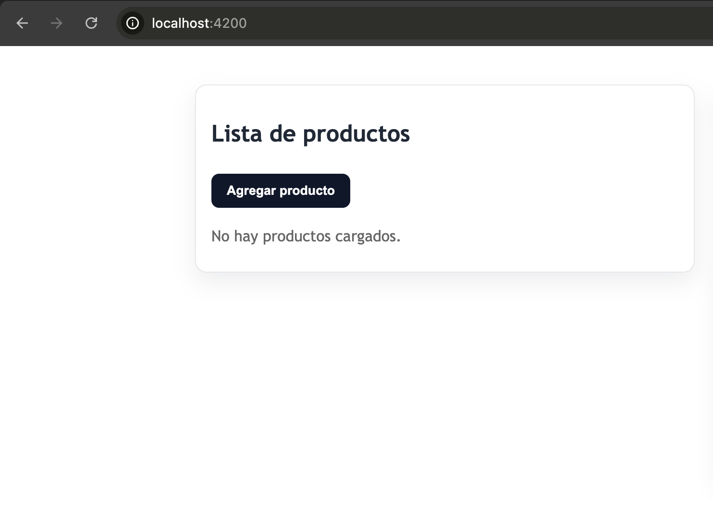
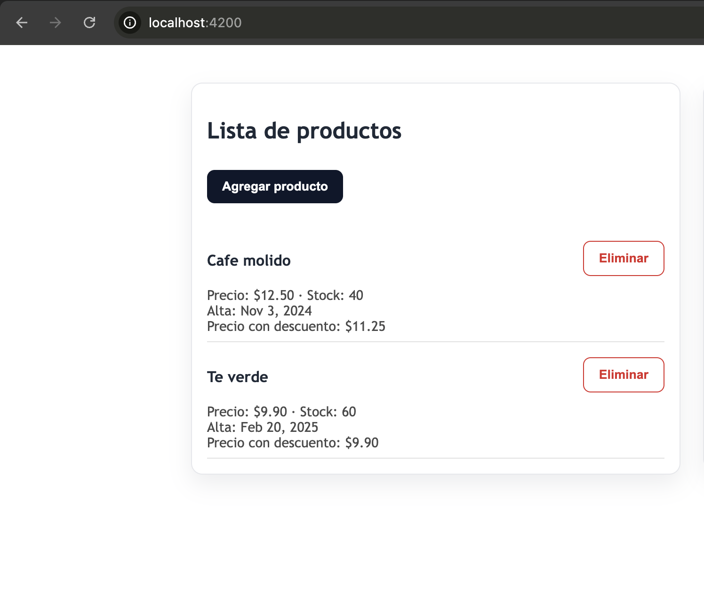
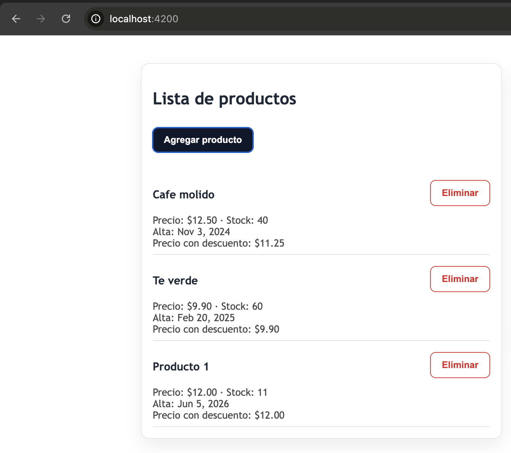

# CursoAngular

## Descipción breve
Primera aplicación práctica del Curso de Angular, incluye modificaciones en el componente raíz para aplicar interpolación de datos, renderizado de imágenes locales y la configuración inicial del entorno.

## Estructura de Archivos Principales

* **`src/app/`**: Es la carpeta principal del proyecto. Contiene el código fuente de la aplicación, incluyendo los componentes, servicios y rutas.
* **`app.component.ts` (en este proyecto `app.ts`)**: Es el componente principal (raíz) de la aplicación. Contiene la lógica en TypeScript que controla la vista principal. Aunque en esta versión generada por el CLI el nombre se abrevia como `app.ts`, su propósito y función dentro de la arquitectura son idénticos.
* **`app.module.ts`**: En aplicaciones Angular tradicionales, es el archivo de configuración principal. Su función es agrupar componentes, directivas y servicios (usando `@NgModule`) para que Angular sepa cómo organizar la aplicación. *(Nota: Al utilizar una versión reciente de Angular con Standalone Components, este archivo no se genera; su función la asume `app.config.ts` y las importaciones individuales).*
* `assets/`**: Es la carpeta destinada a alojar recursos estáticos que no requieren compilación, como imágenes, íconos o fuentes.
* `environments/`**: Carpeta que contiene archivos de configuración para definir variables dependientes del entorno (ej. desarrollo vs. producción). *(Nota: En las versiones más nuevas de Angular CLI, esta carpeta no se genera por defecto para mantener la estructura base más limpia).*

## Capturas de pantalla




## Instrucciones para ejecutar el proyecto
### Requisitos previos
Antes de comenzar, asegúrate de tener instalado en tu entorno:
* **Node.js** (y su gestor de paquetes NPM).
* **Angular CLI** (puedes instalarlo globalmente ejecutando `npm install -g @angular/cli`).

---
Sigue estos pasos para clonar el repositorio y levantar el entorno local:

1. **Clonar el repositorio:**
   Abre tu terminal y ejecuta el siguiente comando:
   ```bash
   git clone https://github.com/ivanskrt/cursoAngularUTN.git
2. **Entrar a la carpeta del proyecto:**
   ```bash
   cd cursoAngularUTN
3. **Instalar dependencias:**
   Descargar los paquetes necesarios de Node
   ```bash
   npm install
4. **Ejecutar la instalación:**
   Inicia el servidor de desarrollo local:
   ```bash
   ng serve

## Creditos del autor
> * Nombre: Ivan Skrt
> * Curso: Desarrollo con Angular
> * Unidad: Modulo 1 - Unidad 1

## Bibliografía y Fuentes
> * Angular. (s.f.-b). The Angular CLI. https://angular.dev/tools/cli
> * Angular. (s.f.-a). Welcome to the Angular tutorial. [Bienvenido al tutorial de Angular].https://angular.dev/tutorials/learn-angular
