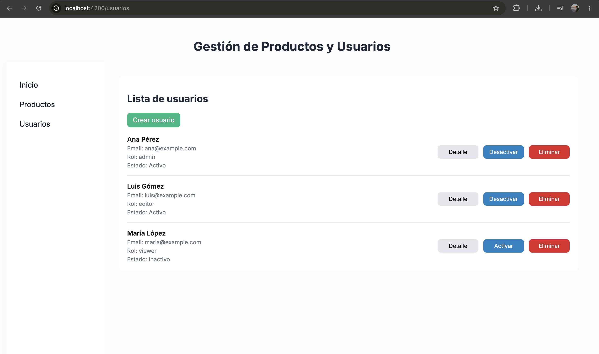
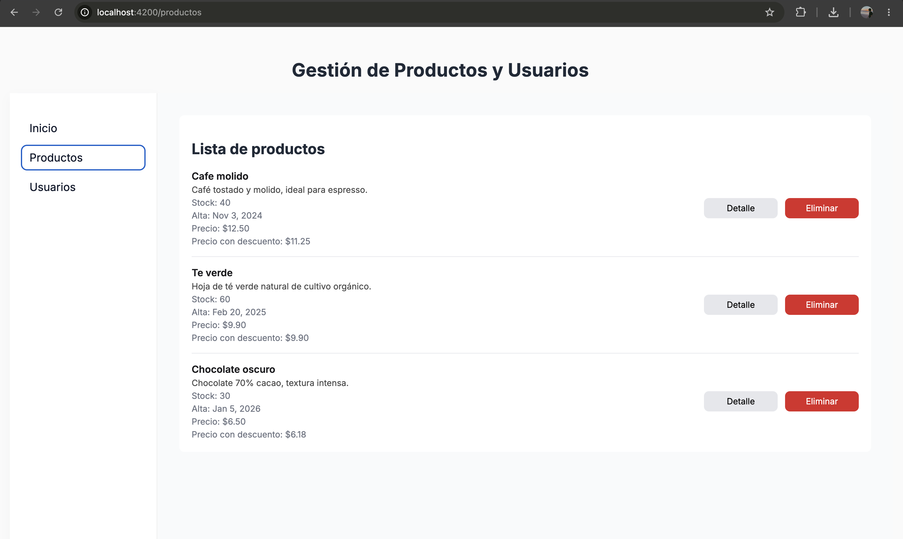

# CursoAngular

## Descipción breve
Aplicación de gestión de estado de productos y usuarios en Angular. El proyecto implementa una arquitectura separada en 3 módulos principales (Inicio, Productos y Usuarios) utilizando Lazy Loading, enrutamiento dinámico, formularios reactivos con validaciones, servicios para la gestión de datos, pipes personalizados y persistencia de navegación mediante localStorage.

## Estructura de Archivos Principales

* **`src/app/`**: Es la carpeta principal del proyecto. Contiene el código fuente de la aplicación, incluyendo los módulos,componentes, servicios y rutas.
* **`src/app/modules/`**: Contiene los módulos de funcionalidad de la aplicación (productos y usuarios). Cada submódulo encapsula sus propios componentes (listas, vistas de detalle, formularios) y sus archivos de rutas (*routing-module.ts*) para implementar el Lazy Loading.
* **`src/app/components/`: Aloja componentes independientes o compartidos, como el módulo de inicio.
* **`src/app/services/`: Contiene los servicios inyectables encargados de centralizar la lógica de negocio y la gestión de datos (simulación de ABM) tanto para productos como para usuarios.
* **`src/app/pipes/`: Directorio destinado a las tuberías personalizadas como el cálculo de descuentos.
* **`app.routes.ts`: Archivo de configuración del enrutamiento principal, donde se definen las rutas base y se orquesta la carga perezosa de los módulos secundarios.
* **`app.ts`: Componente principal de la aplicación. Maneja el diseño estructural, el contenedor dinámico de rutas (router-outlet) y la lógica de interceptación para recordar el último módulo visitado mediante localStorage.
* **`app.config.ts`: Archivo de configuración global que reemplaza al tradicional app.module.ts en las versiones modernas de Angular (Standalone Components), encargado de proveer las rutas y herramientas a nivel de toda la aplicación.

## Capturas de pantalla



## Despliegue en Producción
La aplicación se encuentra desplegada y funcionando en Vercel. Puedes acceder a ella mediante el siguiente enlace:
**[https://curso-angular-utn-ivanskrt.vercel.app/]**

## Instrucciones para ejecutar el proyecto
### Requisitos previos
Antes de comenzar, asegúrate de tener instalado en tu entorno:
* **Node.js** (y su gestor de paquetes NPM).
* **Angular CLI** (puedes instalarlo globalmente ejecutando `npm install -g @angular/cli`).

---
Sigue estos pasos para clonar el repositorio y levantar el entorno local:

1. **Clonar el repositorio:**
   Abre tu terminal y ejecuta el siguiente comando:
   ```bash
   git clone https://github.com/ivanskrt/cursoAngularUTN.git
2. **Entrar a la carpeta del proyecto:**
   ```bash
   cd cursoAngularUTN
3. **Instalar dependencias:**
   Descargar los paquetes necesarios de Node
   ```bash
   npm install
4. **Ejecutar la instalación:**
   Inicia el servidor de desarrollo local:
   ```bash
   ng serve

## Creditos del autor
> * Nombre: Ivan Skrt
> * Curso: Desarrollo con Angular
> * Unidad: Entrega Final

## Bibliografía y Fuentes
> * Angular. (s.f.-b). The Angular CLI. https://angular.dev/tools/cli
> * Angular. (s.f.-a). Welcome to the Angular tutorial. [Bienvenido al tutorial de Angular].https://angular.dev/tutorials/learn-angular
